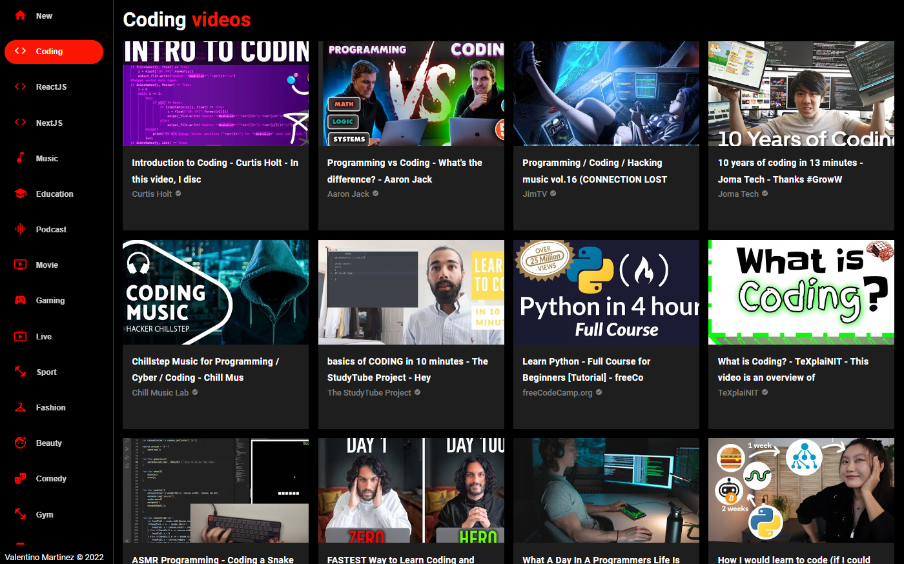
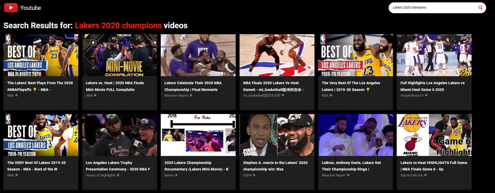
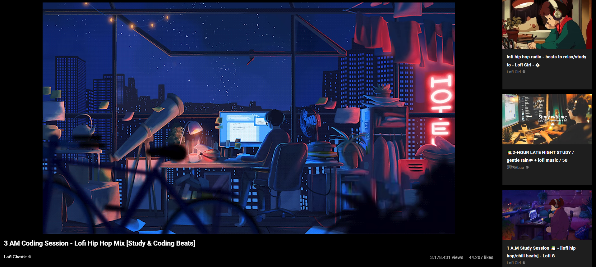
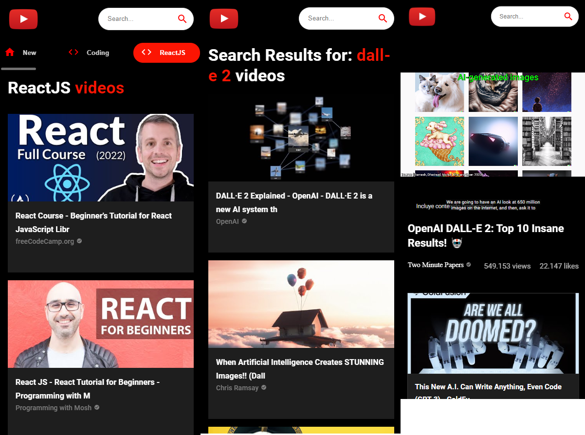

# Hello there, welcome to my Youtube clone project!

This project was made entirely with React JS and Material UI, you will find all their documentation on their respective pages. On the other hand, to use and manipulate the corresponding information, the RapidApi Youtube v3 api was requested.

## Deploy: https://youtube-clone-vm.netlify.app/

 

### How to use it

In order to use the code you just have to:

#### 1 - request an api key in rapidApi (https://rapidapi.com/ytdlfree/api/youtube-v31/)

#### 2 - npm i inside the project

The rest is up to you, contact me for any questions!
valentinomartinez55@gmail.com

## Features:

### Sidebar with different categories where you can search for content

 
 

#### Searchbar where you can search for the content you want!

 
 

#### Player within the same page to see the videos you want

 
 

#### Total responsiveness of all components, adapting to tablets and cell phones without problems

 
 
 

### Look my portfolio to know about me and my other projects!

#### https://valentinomartinez-portfolio.vercel.app/
